# 💎 GemTide – Luxury Jewelry Site & Admin Control Center

GemTide is a modern, high-end e-commerce platform for luxury jewelry and streetwear with 3D product previews, customer checkout flows, and a 2-Factor Authenticated Admin Portal with a disk-backed live Database Observer and JSON Code Editor.

---

## 🔄 System Architecture & Application Flow

```mermaid
flowchart TD
    subgraph Storefront ["🛒 Storefront (Customer Flow)"]
        A["Visitor Browses Catalog"] --> B["Interactive 3D Product View"]
        B --> C["Add to Cart & Select Quantity"]
        C --> D["Checkout Inquiry Form"]
        D --> E["POST /api/orders"]
        E --> F["Deduct Stock & Write to db.json"]
        F --> G["WhatsApp Inquiry Redirect"]
    end

    subgraph AdminPortal ["🔐 Admin Control Center (2FA Protected)"]
        H["Navigate to /admin"] --> I{"Session Authenticated?"}
        I -- No --> J["Step 1: Security Key (Default: GEMTIDE2026)"]
        J -- Key OK --> K["Generate 6-Digit OTP"]
        K --> L["Step 2: Enter 6-Digit OTP"]
        L -- Verified --> M["Access Granted"]
        
        I -- Yes --> M
        M --> N1["📦 Merchant Inventory Control"]
        M --> N2["🛒 Customer Orders & Inquiries"]
        M --> N3["🗄️ Database Manager (Live Observer & Raw JSON Editor)"]
        
        N3 --> O["POST /api/db"]
        O --> P[("disk-backed db.json")]
    end
```



---

## ✨ Features

- **Luxury Glassmorphism UI**: Clean, responsive, dark-mode & light-mode accents built with Tailwind CSS & Framer Motion.
- **Interactive 3D Showcase**: Built using `@react-three/fiber` and `@react-three/drei`.
- **2-Factor Admin Authentication Gate**:
  - **Step 1**: Admin Security Key (`GEMTIDE2026`).
  - **Step 2**: 6-digit One-Time Password (OTP) verification.
  - **Session Re-locking**: Red "Lock Portal" button in header to re-lock sessions instantly.
- **Disk-Backed Database (`db.json`)**:
  - Full API layer: `GET /api/db`, `POST /api/db`, `GET /api/products`, `POST /api/products`, `GET /api/orders`, `POST /api/orders`.
- **Database Control Center & Raw JSON Code Editor**:
  - Real-time JSON syntax error validation.
  - One-click JSON formatting & beautification.
  - Filterable Live Collection Inspector for `products` and `orders`.
  - Import / Export database backups.

---

## 🔑 Admin Credentials (For Testing)

| Guard Step | Input Value |
| :--- | :--- |
| **Security Key** | `GEMTIDE2026` |
| **6-Digit OTP** | Shown on-screen in the simulated secure OTP dispatch banner |

---

## 🛠️ Tech Stack

- **Frontend**: React 18, TypeScript, Vite, Tailwind CSS, Lucide React, Framer Motion
- **3D Graphics**: Three.js, React Three Fiber, React Three Drei
- **Backend / API**: Node.js HTTP Server (`server.js`), Vite API Middleware Plugin (`vite.config.ts`)
- **Database**: Disk-backed JSON engine (`db.json`)

---

## 🚀 Quickstart Guide

### 1. Install Dependencies
```bash
npm install
```

### 2. Start Development Server
Starts Vite dev server + Embedded API Middleware on `http://localhost:5173`:
```bash
npm run dev
```

### 3. Build & Run Production Server
```bash
npm run build
npm start
```
Production server runs at `http://localhost:3000`.

---

## 📁 Repository Structure

```
gemtide-jewelry-site-with-admin/
├── db.json               # Disk-backed database (Products & Orders)
├── server.js             # Node.js production HTTP server & API endpoints
├── vite.config.ts        # Vite configuration & dev server API plugin
├── src/
│   ├── components/       # UI components & 3D viewers
│   ├── data/             # Default product catalog data
│   ├── pages/
│   │   ├── Landing.tsx   # E-commerce store page
│   │   └── Admin.tsx     # 2FA Admin Portal & Database Observer
│   ├── utils/            # Pricing & helper functions
│   ├── App.tsx           # Router & navigation setup
│   └── main.tsx          # Application entry point
├── package.json
└── README.md
```

---

## 📤 Push to GitHub

To push this repository to your GitHub account:

```bash
# 1. Add all files and make initial commit
git add .
git commit -m "Initial commit: GemTide luxury site with 2FA Admin Portal & Live DB Observer"

# 2. Create a repository on GitHub (https://github.com/new) named "gemtide-jewelry-site-with-admin"

# 3. Connect remote and push to main
git branch -M main
git remote add origin https://github.com/YOUR_USERNAME/gemtide-jewelry-site-with-admin.git
git push -u origin main
```
